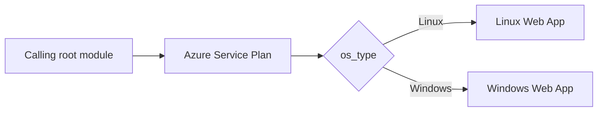

# Terraform Module for Azure App Service

Provisions an [Azure Service Plan](https://registry.terraform.io/providers/hashicorp/azurerm/latest/docs/resources/service_plan)
and one web app for Linux or Windows. The caller owns the resource group,
provider configuration, backend, and Terraform state.

## Dependency Graph



## Usage

```hcl
module "app" {
  source              = "git::https://github.com/f2calv/tf_module_azurerm_app_service_plan.git//src?ref=0.3.2"
  resource_group_name = azurerm_resource_group.rg.name
  location            = azurerm_resource_group.rg.location
  service_plan_name   = "my-service-plan"
  app_service_name    = "my-web-app"
  os_type             = "Linux"
  sku_name            = "F1"
  tags = {
    environment = "dev"
  }
}
```

The resource group in this example is created by the calling root module and is
not managed by this module.

<!-- markdownlint-disable MD060 -->
<!-- BEGIN_TF_DOCS -->
## Requirements

| Name | Version |
| ---- | ------- |
| terraform | >= 1.1 |
| azurerm | >= 5.0, < 6.0 |

## Providers

| Name | Version |
| ---- | ------- |
| azurerm | >= 5.0, < 6.0 |

## Resources

| Name | Type |
| ---- | ---- |
| [azurerm_linux_web_app.this_linux](https://registry.terraform.io/providers/hashicorp/azurerm/latest/docs/resources/linux_web_app) | resource |
| [azurerm_service_plan.this](https://registry.terraform.io/providers/hashicorp/azurerm/latest/docs/resources/service_plan) | resource |
| [azurerm_windows_web_app.this_windows](https://registry.terraform.io/providers/hashicorp/azurerm/latest/docs/resources/windows_web_app) | resource |

## Inputs

| Name | Description | Type | Default | Required |
| ---- | ----------- | ---- | ------- | :------: |
| app\_service\_name | Name of the web app. | `string` | n/a | yes |
| resource\_group\_name | Name of the parent resource group. | `string` | n/a | yes |
| service\_plan\_name | Name of the service plan. | `string` | n/a | yes |
| location | Location of the parent resource group. | `string` | `"West Europe"` | no |
| os\_type | OS type for the service plan (Linux or Windows). | `string` | `"Linux"` | no |
| sku\_name | SKU name for the service plan (e.g. F1, B1, S1, P1v3). | `string` | `"F1"` | no |
| tags | Any tags that should be present on the resources. | `map(string)` | `{}` | no |

## Outputs

| Name | Description |
| ---- | ----------- |
| app\_service\_id | The ID of the web app. |
| app\_service\_name | The name of the web app. |
| default\_hostname | The default hostname of the web app. |
| service\_plan\_id | The ID of the service plan. |
| service\_plan\_name | The name of the service plan. |
<!-- END_TF_DOCS -->
<!-- markdownlint-enable MD060 -->

## Development

Regenerate the Terraform reference after changing resources, variables,
outputs, or version constraints:

```bash
terraform-docs --config .terraform-docs.yml src
```

The pre-commit configuration runs the same command in CI and fails when
generated documentation is not committed.
